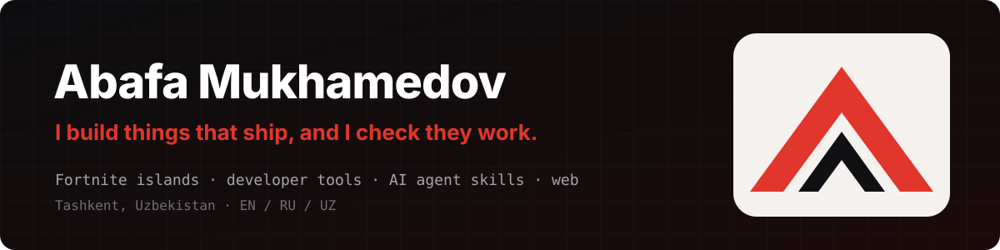
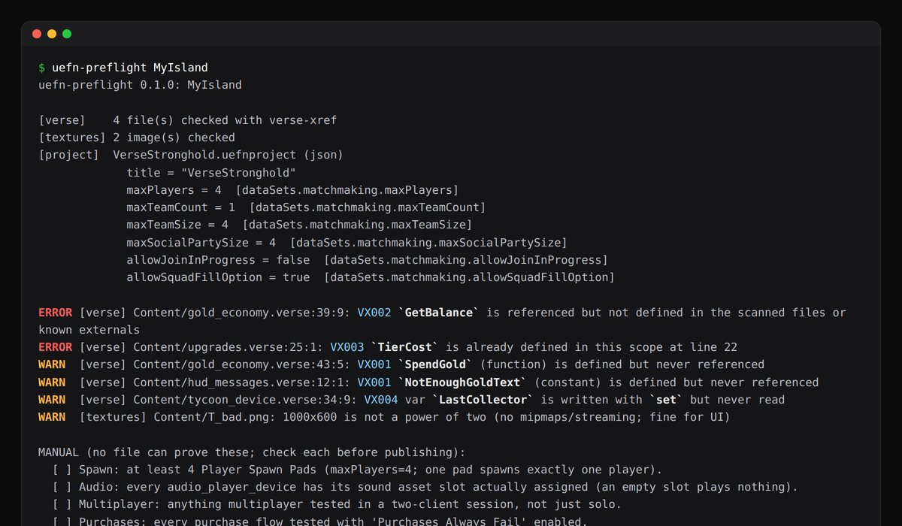
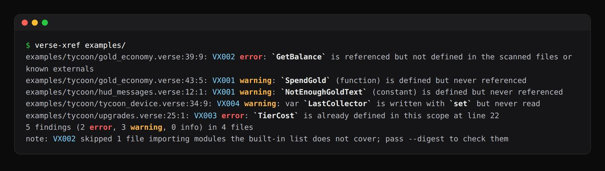
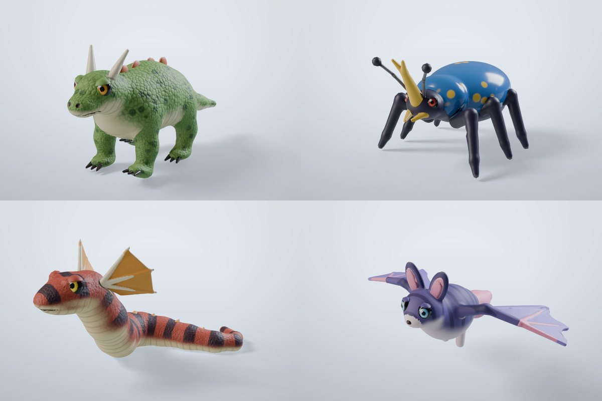
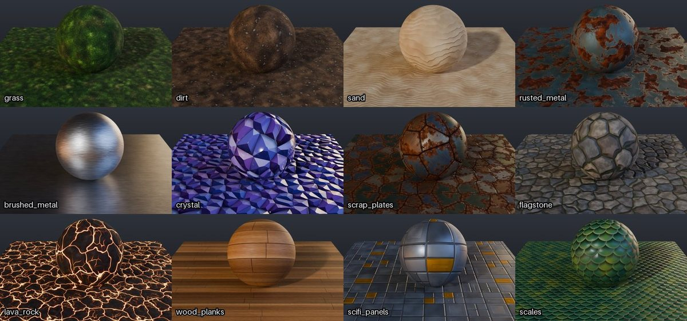
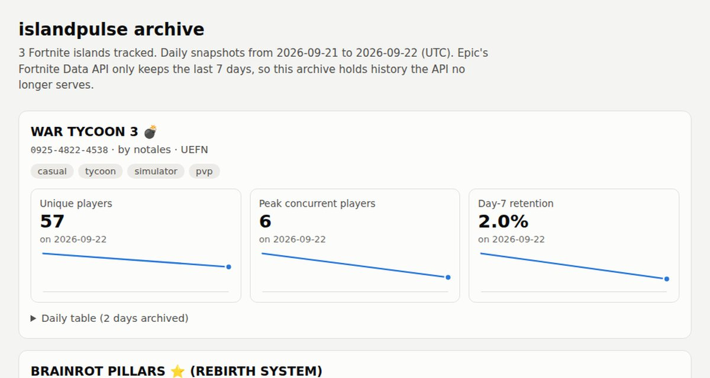
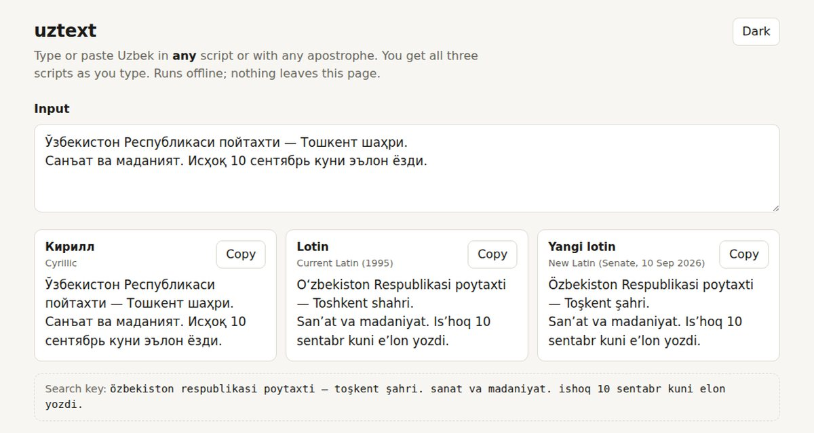
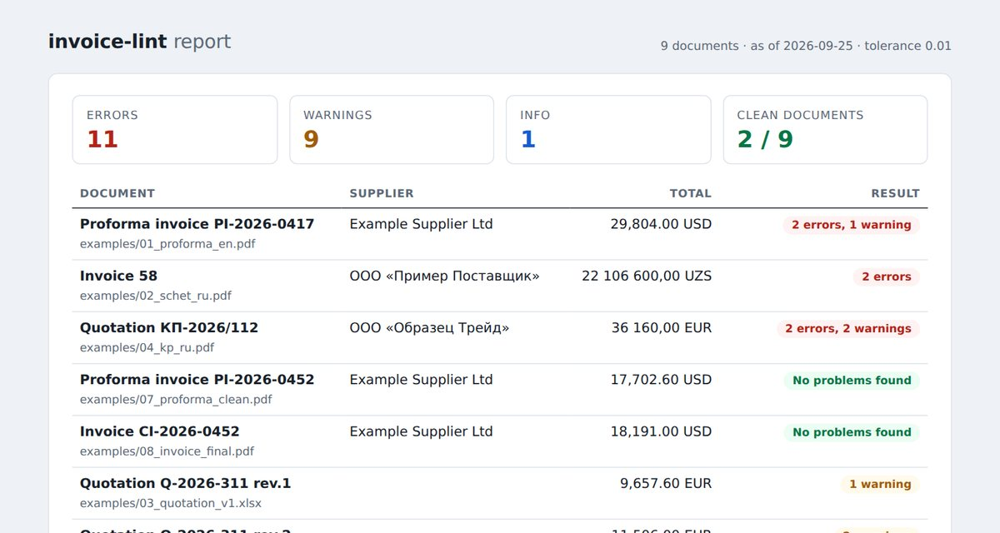
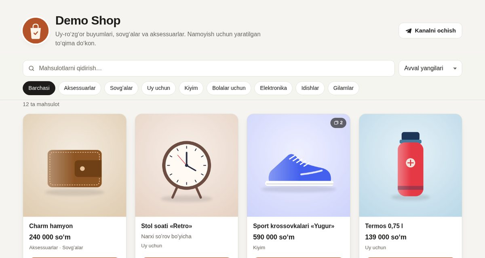
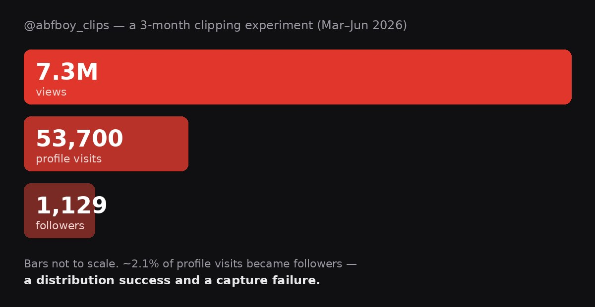

By day I'm a sales manager at a construction-equipment dealer in Tashkent. I read the
engineering documents *and* write the pitch. The rest of the time I ship Fortnite islands with
AI coding agents, and build the tools I wish had existed when something broke.

Every repo here says plainly what has been tested and what hasn't.

## 🎮 Live on Fortnite

Published under creator name **abafaboy**. +1 DAMAGE went from concept to published in a
single day, built with Claude Code driving Unreal Editor for Fortnite (UEFN).

| Island | Code |
|---|---|
| [+1 DAMAGE: LAB LOCKDOWN](https://www.fortnite.com/creative/island-codes/6783-1275-0083) | `6783-1275-0083` |
| [NO REFS \| 4v4 Football](https://www.fortnite.com/creative/island-codes/3600-6909-0110) | `3600-6909-0110` |
| [Core Command: 1v1 Tower Defense](https://www.fortnite.com/creative/island-codes/9358-1440-9230) | `9358-1440-9230` |
| [Grow Your Sidekick](https://www.fortnite.com/creative/island-codes/8012-1531-0518) | `8012-1531-0518` |

## 🛠️ Open source

<table>
<tr>
<td width="50%" valign="top">

<h3><a href="https://github.com/abafaboy/islandsmith">islandsmith</a></h3>
Agent skills that help Claude Code, Codex or Cursor build Fortnite islands that actually work, on top of Epic's official Unreal MCP. About 25 UEFN traps, each with its source. 
Claude Code plugin · Agent Skills · Python
</td>
<td width="50%" valign="top">

<h3><a href="https://github.com/abafaboy/verse-xref">verse-xref</a></h3>
Finds Verse code that compiles but never runs: functions nobody calls, references to things that don't exist, variables that are set and never read. SARIF output and a GitHub Action. 
static analysis · Python · zero dependencies
</td>
</tr>
<tr>
<td width="50%" valign="top">

<h3><a href="https://github.com/abafaboy/creature-forge">creature-forge</a></h3>
Rigged, textured, animated game creatures generated from code in headless Blender, on CPU, ready for Unreal. No GPU, no ML model. Under 90 s per creature on 2 CPUs. 
procedural 3D · Blender (bpy) · Python
</td>
<td width="50%" valign="top">

<h3><a href="https://github.com/abafaboy/seamless">seamless</a></h3>
Game textures that tile by construction (FFT noise and tileable Voronoi), a seam metric, and a repair pipeline that makes AI-generated images tileable. 13 material presets. 
procedural textures · numpy · Python
</td>
</tr>
<tr>
<td width="50%" valign="top">

<h3><a href="https://github.com/abafaboy/islandpulse">islandpulse</a></h3>
A client and daily archiver for Epic's public Fortnite Data API. Epic keeps only 7 days of data, so it saves each day's history to CSV in the repo, where it can't be lost. 
data pipeline · GitHub Actions · Python
</td>
<td width="50%" valign="top">

<h3><a href="https://github.com/abafaboy/uztext">uztext</a></h3>
Uzbek text in all three scripts in use, including the new Latin alphabet approved in September 2026. Python and npm packages checked against the same 699 test cases. 
NLP · Python · TypeScript
</td>
</tr>
<tr>
<td width="50%" valign="top">

<h3><a href="https://github.com/abafaboy/invoice-lint">invoice-lint</a></h3>
Re-checks the arithmetic on supplier proformas, quotations and invoices before you pay: totals, amounts in words (EN / RU / UZ), number formats, Incoterms, and what changed between versions. 
document processing · PDF · Python
</td>
<td width="50%" valign="top">

<h3><a href="https://github.com/abafaboy/tg-storefront">tg-storefront</a></h3>
Turns a public Telegram channel into a shop website with product cards, prices, search and an order button. Free on GitHub Pages; it rebuilds itself as the owner posts. 
static sites · Python · UZ / RU / EN
</td>
</tr>
<tr>
<td width="50%" valign="top">

<h3><a href="https://github.com/abafaboy/clip-velocity">clip-velocity</a></h3>
Ranks Twitch clips by views per hour instead of total views, and renders 9:16 verticals. It comes with the write-up of my three-month clipping experiment: 7.3M views, 1,129 followers. 
video · Twitch API · ffmpeg · Python
</td>
<td width="50%" valign="top">
<h3>Websites</h3>
Sites I've built that are live now:  
• <a href="https://uzrentek.com">uzrentek.com</a>: construction-equipment dealer 
• <a href="https://qpspace.com">qpspace.com</a>: engineering consultancy 
• <a href="https://nedietolog.com">nedietolog.com</a>: nutritionist practice 
• <a href="https://abafaboy.com">abafaboy.com</a>: me 
</td>
</tr>
</table>

## 📈 An experiment, not an abandoned account

From March to June 2026 I ran a Twitch clipping account on TikTok as a deliberate
three-month test. **7.3M views, 600K likes, 69K shares.** The best clip had 663K views, and
87% of traffic came from the For You feed. But only **1,129 of 53,700 profile visitors (about
2%) followed**. The algorithm handed out reach; almost nobody chose the account. So I stopped,
and wrote up why: [clip-velocity/docs/EXPERIMENT.md](https://github.com/abafaboy/clip-velocity/blob/main/docs/EXPERIMENT.md).

## How I work

- I build with AI coding agents (Claude Code) and check their work. Commits say who
  co-authored them.
- "It compiles" is not "it works". I check definitions against call sites, look at every
  render, and test what only a live session can prove.
- If I can't source a claim, it doesn't go in the README.

## Background

IB Diploma (HL Maths, Physics, Economics) · one year of BSc Artificial Intelligence at the
University of Groningen · English, Russian, Uzbek; French and German (B1)

## Contact

Telegram [@abafa_m](https://t.me/abafa_m) · [abafaboy.com](https://abafaboy.com)
