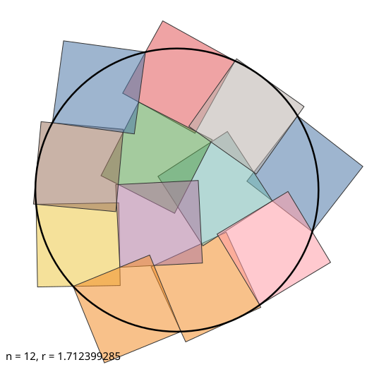
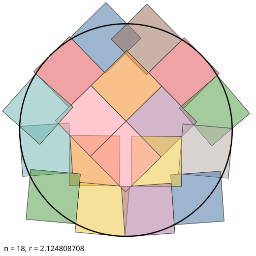
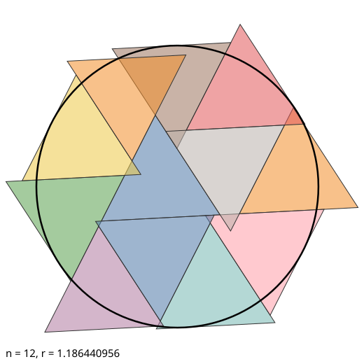

# covering-records

**Better coverings of circles, squares and triangles by unit squares and unit
triangles, each proved in exact arithmetic and checked for originality.**

[Erich Friedman's Packing Center](https://erich-friedman.github.io/packing/) is a
long-running table of best-known packings and coverings. On its covering pages,
most records were set between 1997 and 2009 by hand or with small programs.

This repo contains an optimizer that re-finds most of those records, and beats
the current value in 16 cases on five pages. It also contains two independently
written verifiers that prove each covering in exact arithmetic (rationals and √3,
with no floating point).

A better value is not automatically a new design, so every result was compared
piece by piece with the record picture it beats ([docs/ORIGINALITY.md](docs/ORIGINALITY.md)):

- **<!-- COUNT -->5<!-- /COUNT --> are new configurations:** different
  arrangements from the current picture.
- **11 are re-optimisations:** the same arrangement as the current record with
  the pieces moved slightly. The old hand-made configurations were not fully
  optimized. These are listed separately, and the design is credited to its
  original finder.

| page | question |
|---|---|
| [Squares Covering Circles](https://erich-friedman.github.io/packing/sqcovcir/) | What is the largest circle *n* unit squares can cover? |
| [Triangles Covering Circles](https://erich-friedman.github.io/packing/tricovcir/) | What is the largest circle *n* unit equilateral triangles can cover? |
| [Triangles Covering Squares](https://erich-friedman.github.io/packing/tricosqu/) | What is the largest square *n* unit equilateral triangles can cover? |
| [Squares Covering Triangles](https://erich-friedman.github.io/packing/squcotri/) | What is the largest equilateral triangle *n* unit squares can cover? |
| [Squares Covering Squares](https://erich-friedman.github.io/packing/squcosqu/) | What is the largest square (by area) *n* unit squares can cover? |
| [Triangles Covering Triangles](https://erich-friedman.github.io/packing/tricovtri/) | searched; every record there was re-found, none beaten |

The pieces may overlap and stick out; the target must be covered completely.

## Results

Records are compared with the pages as they stood on **25 September 2026**
(site commit `cd143d9`, re-checked against later commits before submission).
Where a page gives a record only as a truncated decimal ("1.239+"), the true old
value could be anywhere up to the next digit. So a result counts only if it beats
that upper end, and the improvement is shown as a lower bound (≥). All values
are truncated, never rounded up.

<!-- TABLE -->
### Squares covering circles (radius r)

| n | previous record | holder | new value (verified) | improvement | files |
|---|---|---|---|---|---|
| 12 | 1.701+ | David Cantrell, Aug 2002 | **1.712399284** | ≥ +0.0103 | [svg](figures/sq_disk_12.svg) · [cert](certificates/sq_disk_12.json) |
| 18 | 2.116+ | Maurizio Morandi, Jun 2009 | **2.124808707** | ≥ +0.0078 | [svg](figures/sq_disk_18.svg) · [cert](certificates/sq_disk_18.json) |

### Triangles covering circles (radius r)

| n | previous record | holder | new value (verified) | improvement | files |
|---|---|---|---|---|---|
| 9 | (81√3 − 6√30)/106 = 1.013517 | David Cantrell, Jul 2005 | **1.014569554** | +0.001052 | [svg](figures/tri_disk_09.svg) · [cert](certificates/tri_disk_09.json) |
| 12 | (7√3 − √7)/8 = 1.184826 | David Cantrell, Jul 2005 | **1.186440956** | +0.001615 | [svg](figures/tri_disk_12.svg) · [cert](certificates/tri_disk_12.json) |

### Squares covering triangles (side s)

| n | previous record | holder | new value (verified) | improvement | files |
|---|---|---|---|---|---|
| 12 | 2√3 + √6 − √2 = 4.499378 | Maurizio Morandi, May 2009 | **4.506287745** | +0.006909 | [svg](figures/sq_triangle_12.svg) · [cert](certificates/sq_triangle_12.json) |

### Re-optimised versions of the current record arrangements

Each of these beats the current value, and is verified exactly like the new records above. But independent reviewers, matching pieces one-to-one under rotations and reflections, found each configuration to be the same arrangement as the current record's picture with the pieces moved slightly. The design belongs to the original finder, so these are reported as re-optimisations, not as new configurations (see docs/ORIGINALITY.md).

| problem | n | current record | holder | re-optimised value (verified) | files |
|---|---|---|---|---|---|
| Squares covering circles | 7 | 1.239+ | David Cantrell, Jul 2002 | 1.241885665 | [svg](figures/sq_disk_07.svg) · [cert](certificates/sq_disk_07.json) |
| Squares covering circles | 8 | 1.375+ | Maurizio Morandi, Mar 2009 | 1.376427183 | [svg](figures/sq_disk_08.svg) · [cert](certificates/sq_disk_08.json) |
| Squares covering circles | 13 | 1.779+ | Maurizio Morandi, Apr 2009 | 1.781493253 | [svg](figures/sq_disk_13.svg) · [cert](certificates/sq_disk_13.json) |
| Squares covering circles | 17 | 2.042+ | Maurizio Morandi, Jun 2009 | 2.047182900 | [svg](figures/sq_disk_17.svg) · [cert](certificates/sq_disk_17.json) |
| Triangles covering circles | 11 | (177√3 − 2√586)/226 = 1.142293 | David Cantrell, Jul 2005 | 1.142499341 | [svg](figures/tri_disk_11.svg) · [cert](certificates/tri_disk_11.json) |
| Squares covering triangles | 10 | 4.197+ | Maurizio Morandi, Apr 2009 | 4.204241869 | [svg](figures/sq_triangle_10.svg) · [cert](certificates/sq_triangle_10.json) |
| Squares covering triangles | 11 | 4.35451+ | Ryan Chi and d/dx, Sep 2026 | 4.357365965 | [svg](figures/sq_triangle_11.svg) · [cert](certificates/sq_triangle_11.json) |

<!-- /TABLE -->

The values are *certified lower bounds*. Each certificate proves the stated
size is covered, and the true optimum of each configuration is higher by about
10⁻⁹. None of these coverings is claimed to be optimal.

<p>



</p>

## How the results were checked

1. **Exact verifiers** (`src/verify.py`, plus `src/verify_independent.py`, a
   second checker written separately during the audit that uses horizontal
   slabs and its own arithmetic). For `verify.py`: A certificate gives each piece as a
   rational centroid and a rational rotation, meaning cos = (1−t²)/(1+t²) and
   sin = 2t/(1+t²). The verifier builds each piece from those numbers and
   asserts every side has length exactly 1.
   * Square pieces have rational vertices.
   * Triangle pieces have vertices in Q(√3), and every comparison is an exact
     sign test in that field.

   Coverage is then decided by a vertical decomposition of all the edges. Each
   resulting cell is either inside or outside every piece, so one test point
   per cell settles it, and every cell that meets the target must be covered.
   Details are in [docs/METHOD.md](docs/METHOD.md).
2. **Independent float check** (`src/crosscheck.py`). A separate
   implementation using Shapely/GEOS. It shares no code with the verifier.
3. **Negative controls** (`tests/test_verify.py`). Enlarging any certified
   target by one part in a million makes both checks fail, so neither can pass
   by accident. The tests also cover edge cases: a 2×2 block of squares covers
   the disk of radius 1 exactly, but not radius 1 + 10⁻¹².
4. **Pre-submission audit.** Independent reviewers re-ran every check, compared
   each value with the live page, and searched papers, repositories and forums
   for better values; none were found. They also attacked the verifier: fuzzing
   thousands of near-coverings and a line-by-line soundness review found no
   false accepts. Input validation has since been hardened.
5. **The search re-finds the old records.** For every instance it did not beat,
   the optimizer reached the old value to seven or more decimals when the page
   gives a closed form, or landed inside the printed three-decimal interval.
   Three instances fell short and are listed in
   [results/all.md](results/all.md): 12 triangles covering a square (0.012
   short), and 11 and 15 squares covering a circle (0.0002 short).

What has **not** been done: nobody outside this repo has checked these yet. The
16 submitted pictures and the email text
([`submission/email.txt`](submission/email.txt)) were sent to Erich Friedman on
25 September 2026, following
[his guidelines](https://erich-friedman.github.io/packing/submit.html). Nothing
counts as a record until he accepts it and updates the pages.

## How the records were found

Fix the target at size 1 and place *n* pieces by centroid and angle. For each
point *p*, ask how much the nearest piece would need to grow about its centroid
to reach *p*: its gauge function, which is piecewise linear. The largest such
growth factor over the target, *F*, is the scale at which the pieces cover the
target, so unit pieces cover a target of size 1/*F*.

*F* can be evaluated exactly by enumerating the finitely many points where its
maximum can sit. The search has three stages:

1. a smoothed version of *F* on ~2,300 sample points, minimised with L-BFGS
   (JAX gradients) from random starts;
2. an exact minimax polish (SLSQP over the near-active vertices, with
   complex-step Jacobians);
3. basin hopping, run on four processes.

A full run over all 40 instances takes a few hours on 4 CPU cores. See
[docs/METHOD.md](docs/METHOD.md).

## Reproduce

```bash
pip install numpy scipy jax shapely pillow gmpy2   # gmpy2 optional, only makes verify.py faster
cd src
python verify.py ../certificates/*.json        # exact check, ~10 s total
python verify_independent.py ../certificates/*.json   # second, independent exact check
python crosscheck.py ../certificates/*.json    # independent float check
python -m pytest ../tests                      # includes the negative controls
python search.py sq disk 12 --restarts 5 --hops 60   # re-run a search (4 workers)
python report.py                               # rebuild certificates, figures, tables
```

## Files

| path | what |
|---|---|
| `certificates/` | exact certificates (JSON, rational numbers as strings) |
| `figures/` | SVG pictures of every new record |
| `results/table.md`, `results/all.md` | results; status of every instance searched |
| `results/raw/` | best configuration found for each instance, as the optimizer left it |
| `results/logs/` | search logs |
| `submission/` | pictures and values formatted for Friedman's submission guidelines |
| `src/opt.py`, `src/search.py` | the optimizer |
| `src/verify.py`, `src/verify_independent.py`, `src/crosscheck.py` | exact verifier, second independent exact verifier, float check |
| `docs/ORIGINALITY.md` | how each result was compared with the record it beats, and the verdicts |
| `docs/METHOD.md` | the maths and the argument for why the verifier is sound |

## Credits

The problems and the previous records come from Erich Friedman's Packing Center
and its contributors, among them Trevor Green, David Cantrell, Maurizio Morandi,
David Paterson and Ryan Chi.

By Abdulfayyod Mukhamedov with [Claude Code](https://claude.com/claude-code). The
search code, verifier and write-up were produced by Claude Code in a session run
by Abdulfayyod, and each record was checked by the exact verifier before being
listed. MIT licence.
